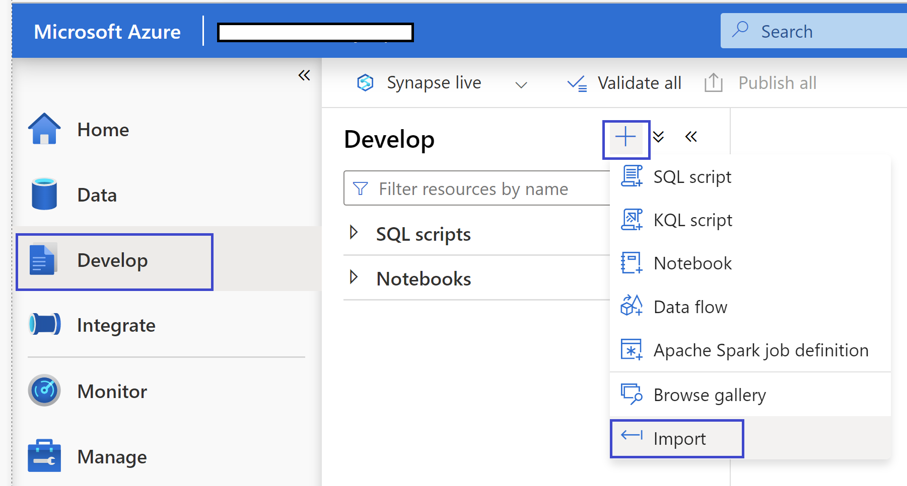
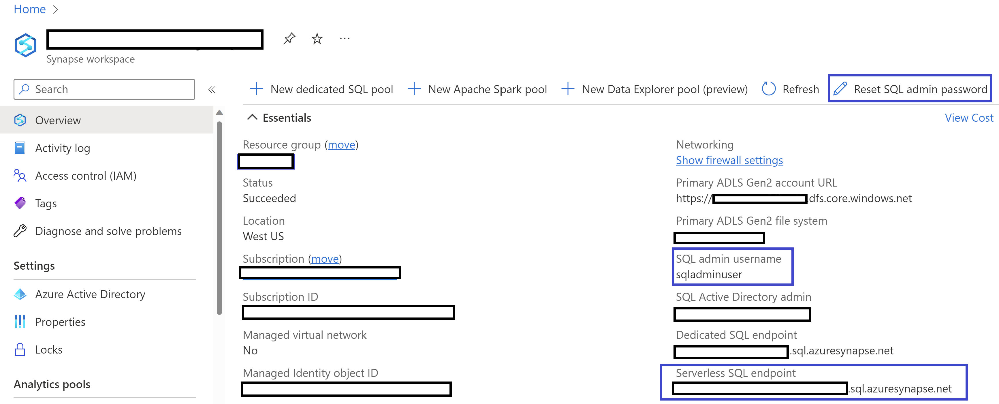

# HTAP Demo using Synapse Link for Cosmos DB

An end to end demonstration of Cloud-native hybrid transactional and analytical processing (HTAP) capability that enables near real time analytics over operational data in Azure Cosmos DB using Azure Synapse Link for Cosmos DB.

Synapse Link for Cosmos DB automatically syncs data between the Transaction store and Analytical store. The analytical store data can be processed using SQL Serverless or Spark runtime, thus making the analytical workload cost effective and independent of the transactional compute resources.

## Setting up the Environment

### Create your Cosmos DB SQL Account

Refer to [Create an Azure Cosmos DB SQL API account](https://docs.microsoft.com/azure/cosmos-db/sql/how-to-create-account?tabs=azure-portal)


### Create your Synapse Workspace
The below steps will create an Azure Synapse workspace using the Azure portal.

1. Open the Azure portal, and at the top search for Synapse.

2. In the search results, under Services, select Azure Synapse Analytics.
3. Select Add to create a workspace.
4. In the Basics tab, give the workspace a unique name. We'll use mysworkspace in this document
5. You need an ADLSGEN2 account to create a workspace. The simplest choice is to create a new one.
    1. Under Select Data Lake Storage Gen 2, click Create New and name it contosolake.
    2. Under Select Data Lake Storage Gen 2, click File System and name it contosofs.

6. Select Review + create > Create. Your workspace is ready in a few minutes.

After your Azure Synapse workspace is created, you have two ways to open Synapse Studio:

1. Open your Synapse workspace in the Azure portal. On the top of the Overview section, select Launch Synapse Studio.
2. Go to the https://web.azuresynapse.net and sign in to your workspace.

### Add Cosmos DB as linked Database
Refer to [Connect an Azure Cosmos DB database to a Synapse workspace](https://docs.microsoft.com/azure/synapse-analytics/quickstart-connect-synapse-link-cosmos-db#connect-an-azure-cosmos-db-database-to-a-synapse-workspace)

### Enable Synapse Link in a Cosmos DB Account

Refer to [Enable Synapse Link in your Cosmos DB SQL API or MongoDB API account using Azure CLI or PowerShell](https://docs.microsoft.com//azure/cosmos-db/configure-synapse-link#command-line-tools).

**Note:** If you can enable Synapse link via the Azure portal you will not be able to set analytical storage to FullFidelity. Therefore, we will enable Synapse Link and set schema using CLI.

Replace the {Cosmos Account Name} placeholder with your own value and run the below command to enable Synapse link on your Cosmos DB Account.

```azurecli
az cosmosdb update --name {Cosmos Account Name} --analytical-storage-schema-type FullFidelity --enable-analytical-storage true
```

### Import the Spark Notebook and SQL View in Synapse

1. In Synapse Studio, Open the Develop Blade
2. Click on the "+" icon and  then select Import.
3. Browse and locate the Spark Notebook and SQL View files.

    

## Run the Demo

### SQL Serverless

1. Open the **CreateView** SQL file from the Develop tab in Synapse Studio.
2. Update the {Cosmos Account Name} and {Cosmos PRIMARY Key} placeholders.
3. Execute the scripts to create the SQL View. Follow the instructions provided as comments.
4. To connect to the SQl Serverless, get the connection details from the Synapse workspace Overview tab.
    1. Generate the password using **Reset SQL admin password** link.
    2. Use **Severless SQL endpoint** value as the Server Name
    3. Use **SQL admin username** value as the User Name

    

### Spark Runtime

1. Open the **GenerateBill** Spark Notebook from the Develop tab in Synapse Studio.
2. Execute the scripts in sequence. Follow the instructions provided.

## Additional Resources
- [Azure Synapse Link for Azure Cosmos DB, benefits, and when to use it](https://docs.microsoft.com/azure/cosmos-db/synapse-link)
- [Configure and use Azure Synapse Link for Azure Cosmos DB](https://docs.microsoft.com/azure/cosmos-db/configure-synapse-link)
- [Frequently asked questions about Azure Synapse Link for Azure Cosmos DB](https://docs.microsoft.com/en-us/azure/cosmos-db/synapse-link-frequently-asked-questions)